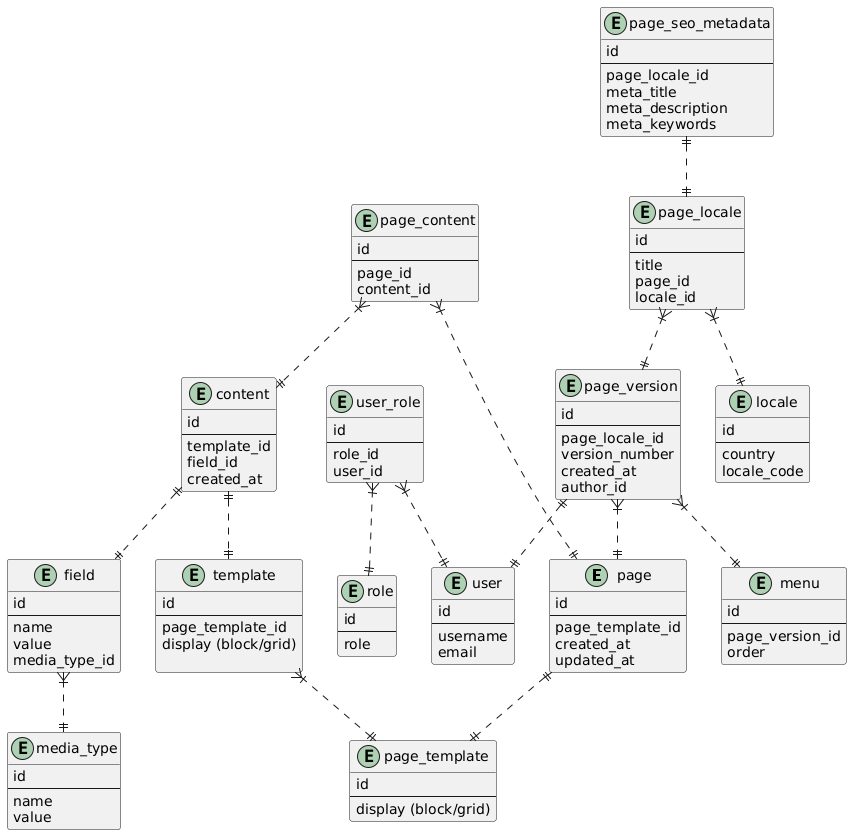

# VictoryCenter Backend Application: Structure

This is a documentation on initialization of VictoryCenter solution, it's structure, as well as an introduction for new developers on where they should start their work.

## Application Stack

Technologies:
- .Net Core 9
- Entity Framework Core (Microsoft.EntityFrameworkCore, Microsoft.EntityFrameworkCore.SqlServer, Microsoft.EntityFrameworkCore.Tools)
- MediatR (MediatR, MediatR.Extensions.Microsoft.DependencyInjection)
- xUnit, Moq


## General Structure

Application should consist of (at least) 4 projects.
- Web Layer: `VictoryCenter` (Controllers, Models)
- Buisness Logic Layer: `VictoryCenter.BLL` (Dtos, Services, Interfaces)
- Data Access Layer: `VictoryCenter.DAL` (DbContext, Entities)
- Unit test project: `VictoryCenter.UnitTests`
- Integration tests project: `VictoryCenter.IntegrationTests` (optional for now)

Web Layer should reference BLL and DAL, BLL should reference DAL. Unit test project should reference all three other projects.

Web Layer project should be Web Api template, BLL and DAL should be class libraries templates (see in Visual Studio, when you create a new project). Unit tests project can be created using xUnit tests template.

**Overoll folder structure:**

```
VictoryCenter (Solution)
│
├── VictoryCenter/                        ← Presentation Layer (Web API)
│   ├── Controllers/                  ← API endpoints
│   │   └── PagesController.cs
│   ├── Program.cs
│   ├── appsettings.json
│   └── ...
│
├── VictoryCenter.BLL/               ← Business Logic Layer (CQRS, Services, DTOs)
│   ├── Commands/                    ← Write operations
│   │   └── CreatePage/
│   │       ├── CreatePageCommand.cs
│   │       ├── CreatePageHandler.cs
│   │       └── CreatePageValidator.cs (optional, with FluentValidation)
│   │
│   ├── Queries/                     ← Read operations
│   │   └── GetAllPages/
│   │       ├── GetAllPagesQuery.cs
│   │       └── GetAllPagesHandler.cs
│   │
│   ├── Interfaces/                  ← Business layer contracts
│   │   └── IPagesService.cs 
|   |
|   ├── Services/
|   |   └── PagesService.cs         ← Business layer services
│   │
│   ├── DTOs/                        ← Data Transfer Objects
│   │   └── PageDto.cs
│   │
│   └── ...
│
├── VictoryCenter.DAL/           ← Data Access Layer (EF Core, Repository)
│   ├── Data/                        ← DbContext and EF config
│   │   └── VictoryCenterDbContext.cs
│   │
│   ├── Entities/                    ← Domain Models (EF Entities)
│   │   └── Page.cs
│   │
│   ├── Enums/               ← Enums
│   │   └── PageType.cs
│   │
│   └── ...
│
├── VictoryCenter.UnitTests/           ← Unit tests (xUnit)
│   ├── Tests/                        ← Tests
│   │   └── PagesServiceTests.cs
│   │
│   ├── Configuration/                    ← Any possible helper setups
│   │   └── DbContextMock.cs (for example)
│   │
│   ├── TestData/               ← Test data (optional)
│   │   └── PageData.json
│   │
│   └── ...
│
├── VictoryCenter.IntegrationTests/           ← Integration tests 
│   ├── Tests/                        ← Tests
│   │   └── RequestTest.cs
│   │
│   ├── TestData/               ← Test data (optional)
│   │   └── data.json
│   │
│   └── ...
│
└── VictoryCenter.sln                        ← Solution file
```


## Web Layer 🌐

Should contain controllers (for example, `PageController.cs`) and models for API (`PageModel.cs`, this one is completely optional).

Web API controllers should probably return only json types reponses (but you as a developer are free to consider other options).
For JSON-formatted responses use `IActionResult`, `Ok()`, `NotFound()` etc. Think about exception handling here, HTTP response codes.

Mappers (consider installing AutoMapper NugetPackage) between types (example: Page and PageDto).
How to use AutoMapper: https://supino0017.medium.com/automapper-for-object-mapping-in-net-8-5b20a034de8c

Reference all configurations in `appsettings.json` locally, submit config file with empty values to github. Do not commit secrets to Github.

Add an extension method (for example, in `ServicesConfiguration.cs`) where you would provide dependency injection.

Consider enabling Swagger (OpenAPI) for auto-generating API documentation: https://learn.microsoft.com/en-us/aspnet/core/tutorials/getting-started-with-swashbuckle?view=aspnetcore-8.0&tabs=visual-studio.

Up to your consideration: GraphQL endpoint (use HotChocolate if you decide to go down that route 🧙‍♂️)


## BLL 🧮

Create folders Services and Interfaces. Services folder should contain services, that are responsible for buisness logic of application, Interfaces should contain all the interfaces for these services.
Do not forget to implement dependency injection for interfaces in separate method, and call it in `Program.cs`.

Example: `PagesService.cs` and `IPagesService.cs` (interface).

You as a developer are free to consider other approaches (abstract class for multiple adjacent types, one interface, etc.)

Also this project should contain: DTOs (example: `PageDto.cs`), helpers, etc.

**CQRS** (would be nice to have, please consider): Create folders Commands and Queries. In them, you will be filling in commands, queries and handlers. Handlers will use services for Services folder, in services you will add any additional buisness logic. Services will use dbContext.

*Get familliar with CQRS pattern:* https://medium.com/@cizu64/cqrs-in-net-core-a8eaeb1c6f06


## DAL 💾

Should contain dbContext class (`VictoryCenterContext.cs`), entities (`Page.cs`), and migrations folder. Also generate sql scripts file containing schema.

Please, generate migrations via command 

`dotnet ef migrations add <MigrationName> -s <sln file location> --context VictoryCenterContext` 

and update sql schema file via 

`dotnet ef migrations script -s <sln file location> --context VictoryCenterContext -i -o  Schema.sql`

This project can also contain enums.

## More on database entities 

Courtesy of @LanchevychMaxym (great thanks to Maksym for it! ❤️) we have an UML diagram you should start working with :)

Here it is:



A bit more detailed description:

| **Table Name**      | **Description**                                                   | **References**                                              | **Example Fields**                     |
| ------------------- | ----------------------------------------------------------------- | ----------------------------------------------------------- | -------------------------------------- |
| `page`              | Represents a web page entity.                                     | References `page_template` via `page_template_id`.          | `id` (not null), `created_at` , `updated_at`       |
| `page_template`     | Defines layout structure for pages.                               | Referenced by `page` and `template`.                        | `id` (not null), `display`                        |
| `template`          | Associates templates with content fields.                         | References `page_template`, `field`.                        | `id` (not null), `display`, `page_template_id`    |
| `field`             | Stores content fields (e.g., text, image).                        | References `media_type` via `media_type_id`.                | `id` (not null), `name`, `value`                  |
| `media_type`        | Defines types of media used in fields (e.g., text, image, video). | -                                                           | `id` (not null), `name`, `value`                  |
| `content`           | Stores the actual content for fields.                             | References `template` and `field`.                          | `id` (not null), `created_at`                     |
| `page_content`      | Connects pages to content blocks.                                 | References `page` and `content`.                            | `id`  (not null)                                 |
| `page_locale`       | Represents a localized version of a page.                         | References `page` and `locale`.                             | `id` (not null), `title`                          |
| `locale`            | Defines localization/country settings.                            | -                                                           | `id` (not null), `country`, `locale_code`         |
| `page_version`      | Stores versioned data for localized pages.                        | References `page_locale` and `user` (as `author_id`).       | `id` (not null), `version_number`, `created_at`   |
| `page_seo_metadata` | Stores SEO metadata for a localized page.                         | References `page_locale`.                                   | `id` (not null), `meta_title`, `meta_description` |
| `menu`              | Represents a navigational structure (e.g., sidebar, top menu).    | References `page_version`.                                  | `id` (not null), `order`                          |
| `user`              | Application users (e.g., admins, editors).                        | Referenced by `page_version` (as `author_id`), `user_role`. | `id` (not null), `username`, `email`              |
| `role`              | Defines roles (e.g., Admin, Editor).                              | Referenced by `user_role`.                                  | `id` (not null), `role`                           |
| `user_role`         | Connects users to roles.                                          | References `user` and `role`.                               | `id` (not null)                                  |

In my opinion, a good starting point would be anything Page related (for example, endpoint for CRUD operations with Page, as well as data on PageTemplates and PageLocales)

## XUnit test project

Should reference xUnit, Moq nuget packages. Suggestion: you may also use Fixture.

Cover every service in BLL with testcases. 
For example, for `PagesService.cs` create `PagesServiceTests.cs`, with testcase for each respective method.


## Recommendations 

Please, use standart C# code conventions:
https://learn.microsoft.com/en-us/dotnet/csharp/fundamentals/coding-style/coding-conventions

Please, always request PR review from @maxvonlancaster and at least 2 other developers on the project 👓.
Do not hesitate to review others work if you are requested to, the more comments the better!

Please, always thoroughly test your code before submitting PR. Test locally with Postman/Insomnia, may use local db replica (good practice) 🔭.

Try to keep code test coverage at least 70%. Cover as much code as possible with unit tests in each PR 🧪.

Document new feature that you develop, in .md files, and submit them with the PR. Link tickets, related to your work, in PR description.

Contact @maxvonlancaster in case of any issues/questions/suggestions.

Do not worry, be happy 🙂


## Additional Suggestions

After discussion with Maksym Lanchevych, some additional points raised:
- Adding Nuke for build actions 
- DbUpdate project for sql migrations: https://dbup.readthedocs.io/en/latest/
- Adding appsettings.Local.json for local purposes
- Set up code analysers: https://learn.microsoft.com/en-us/dotnet/csharp/fundamentals/coding-style/coding-conventions#tools-and-analyzers
